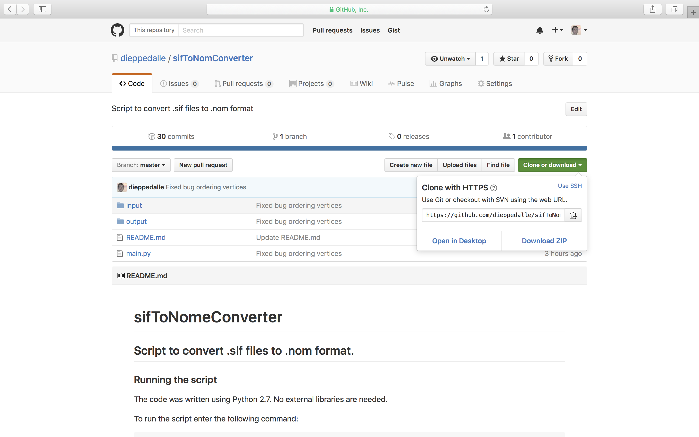
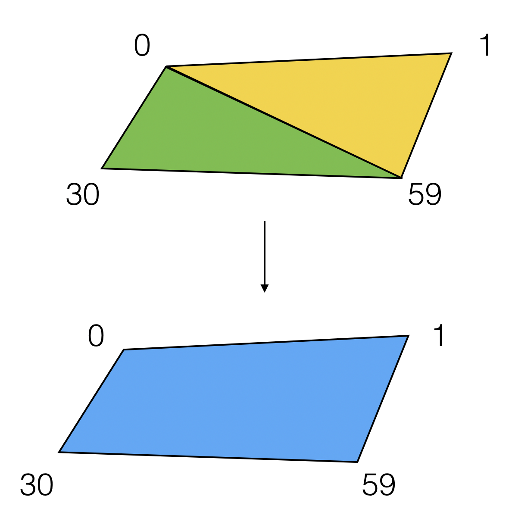

# sifToNomeConverter
## Script to convert .sif files to .nom format.

### Installation
The code was written using [Python 2.7](https://www.python.org/downloads/). No external libraries are needed. Download Python 2.7 from https://www.python.org/downloads/.

To download the files, either:
* Open your browser and navigate to https://github.com/dieppedalle/sifToNomConverter/. Click on "Clone or Download"->"Download Zip".
* Open your browser and navigate to https://github.com/dieppedalle/sifToNomConverter/. Click on "Clone or Download" and copy the URL. Then open terminal (on macOS) or command prompt (on Windows) and type (where PASTE_URL is the copied URL):
```
git clone PASTE_URL 
```


### Running the script


To run the script, open terminal (on macOS) or command prompt (on Windows) application. ```cd``` or ```dir``` into the downloaded folder and enter the following command:
```
python main.py
```
The above command will launch the application. The application will read the inputFile as a .sif file and produce outputFile as a .nom file. The user will be prompted to enter an input path and an output path corresponding to the path of the input file and the path of the output file (for example: ```/Users/dieppedalle/Documents/Research/sifToNomConverter/input/input.sif```).


### Convert triangle faces to square faces
The checkbox below the two input boxes will enable a flag to merge the triangle faces into square faces whenever it is possible (as a result less faces will be created).

For example, with the True flag the following faces:
```
face f0 (v0 v1 v59) endface
face f1 (v0 v59 v30) endface
```
would become
```
face f0 (v30 v0 v1 v59) endface
```

